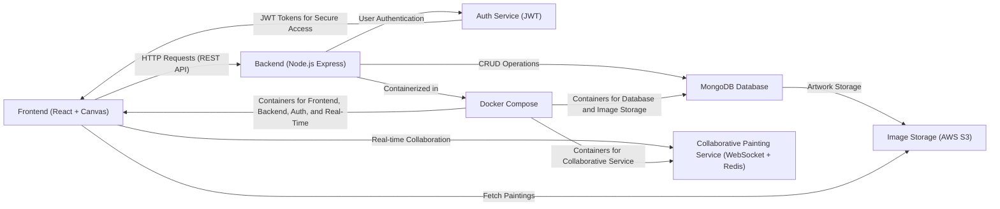

# COMPSCI 426 SCALABLE WEB SYSTEMS
## SPRING 2025
## FINAL PROJECT SUBMISSION

---

# Information

- Name: Samuel Guzman Hernandez
- Email: sguzmanherna@umass.edu
- Spire ID: 33975818
- GitHub User ID: elsamird003
- Graduation Semester: Spring 2025

---

# Overview

**Team Number:**
- Team 6

**System Name:**
- LeafDex

**Project Description:**
- <TODO: Describe the system in a brief paragraph (less than 200 words). 
  What problem does it solve? Who is the target audience?>
  Know your Greens with LeafDex! LeafDex is an application designed to allow users to take photos that will be identified by LeafDex. LeafDex will have mobile and web front ends for access from all you devices. LeafDex aims to be a platform that allows you to explore your enviroment and learn more about the plant life around you!

---

# Architecture Overview

**Primary Architecture Components:**
- <TODO: List and briefly describe the main components of your system 
  (e.g., front-end, back-end, database, etc.).>
  -  **Frontend (React + Tailwind):** 
    The app contains video in the background for a more enhacing experience with the user. Top navigation , eye pleasant colors for more user friendly experience.
     **Backend (Node.js + Express):** 
     Back end has been build using node.js and express js.
     Multi account support avaliable


    

**Communication Between Components:**
- <TODO: Describe how the components communicate with each other 
  (e.g., REST APIs, WebSockets, Pub/Sub, etc.).>

**Data Storage:**
- <TODO: Describe how and where data is stored (e.g., relational databases, 
  NoSQL, file storage, etc.).>

# Architecture Diagram



---

# Code Demonstration

## Front-End Code

```javascript
// TODO: Provide the front-end code you worked on here
// Ensure that the code is properly formatted and includes comments to explain key sections

// Example:
function fetchData() {
    // Fetch data from backend API
    fetch('http://localhost:3000/data')
        .then(response => response.json())
        .then(data => console.log(data))
        .catch(error => console.error('Error:', error));
}
```

- **Description:** 
  <TODO: Provide a brief description of the front-end code and its functionality.>

## Microservice Code

import express, { Request, Response } from 'express';
import { pino } from 'pino';
import fetch from 'node-fetch'; // Needed for image fetching in Node < 18
import OpenAI from 'openai';
const client = new OpenAI({
  apiKey: process.env.OPENAI_API_KEY
});

const PORT = process.env.PORT || 3000;
const REGISTRY_URL = process.env.REGISTRY_URL || 'http://registry:3000';
const IMG_API_URL = process.env.IMG_API_URL || 'https://plant.id/api/v3';
const PLANT_ID_API_KEY = process.env.PLANT_ID_API_KEY;

// Validate required environment variables
if (!process.env.OPENAI_API_KEY) {
  throw new Error('OPENAI_API_KEY environment variable is required');
}

if (!PLANT_ID_API_KEY) {
  throw new Error('PLANT_ID_API_KEY environment variable is required');
}

// Log startup configuration (without sensitive data)
const log = pino({ transport: { target: 'pino-pretty' } });
log.info({
  port: PORT,
  registryUrl: REGISTRY_URL,
  imgApiUrl: IMG_API_URL,
  openaiConfigured: !!process.env.OPENAI_API_KEY,
  plantIdConfigured: !!PLANT_ID_API_KEY
}, 'Service configuration');

const app = express();
app.use(express.json());

// Helper to fetch image and convert to base64
async function fetchImageAsBase64(url: string): Promise<string> {
  const response = await fetch(url);
  const buffer = await response.arrayBuffer();
  return `data:image/jpeg;base64,${Buffer.from(buffer).toString('base64')}`;
}

// Service registration logic
async function registerWithRetry(name: string, url: string, maxRetries = 5) {
  for (let i = 0; i < maxRetries; i++) {
    try {
      const res = await fetch(`${REGISTRY_URL}/register`, {
        method: 'POST',
        headers: { 'Content-Type': 'application/json' },
        body: JSON.stringify({ name, url }),
      });
      if (!res.ok) throw new Error(`Status ${res.status}`);
      log.info('Registered with registry');
      return;
    } catch (err) {
      log.warn(`Failed to register (attempt ${i + 1}): ${(err as Error).message}`);
      await new Promise(r => setTimeout(r, 1000 * (i + 1)));
    }
  }
  log.error('Could not register with registry. Exiting.');
  process.exit(1);
}

// Image generation + plant ID endpoint
app.get('/', async (req: Request, res: Response) => {
  // const ID_PLANT_ENDPOINT = '/identification';
  const plantType = req.query.plantType as string || 'Monstera';
  
  log.info({ plantType }, 'Starting request for plant image generation');

  try {
    // Step 1: Generate image from DALL·E
    log.info('Attempting to generate image with DALL-E...');
    const imageRes = await client.images.generate({
      model: 'dall-e-3',
      prompt: `A realistic photo of a ${plantType} plant in a pot on a wooden table`,
      n: 1,
      size: '1024x1024',
    });
    log.info('DALL-E response received');

    if (!imageRes.data?.[0]?.url) {
      log.error('DALL-E response missing image URL', { response: imageRes });
      throw new Error('Failed to generate image URL from OpenAI');
    }

    const imageUrl = imageRes.data[0].url;
    log.info({ imageUrl }, 'Generated image URL received');

    // Step 2: Convert image to base64
    log.info('Converting image to base64...');
    const base64Image = await fetchImageAsBase64(imageUrl);
    log.info('Image converted to base64 successfully');

    // Step 3: Send to Plant.id API
    log.info('Sending request to Plant.id API...');
    const apiBody = {
      images: [base64Image],
      latitude: 49.207,
      longitude: 16.608,
      similar_images: true,
    };

    // const apiResponse = await fetch(`${IMG_API_URL}${ID_PLANT_ENDPOINT}`, {
    //   method: 'POST',
    //   headers: {
    //     'Api-Key': PLANT_ID_API_KEY,
    //     'Content-Type': 'application/json',
    //   },
    //   body: JSON.stringify(apiBody),
    // });

    // if (!apiResponse.ok) {
    //   const errorText = await apiResponse.text();
    //   log.error({
    //     status: apiResponse.status,
    //     statusText: apiResponse.statusText,
    //     error: errorText
    //   }, 'Plant.id API error response');
    //   throw new Error(`Plant.id API responded with status: ${apiResponse.status} - ${errorText}`);
    // }

    // const plantData = await apiResponse.json();
    // log.info('Successfully received plant identification data');

    res.json({
      from: 'openai + plant.id',
      generated_image_url: imageUrl,
      // plant_data: plantData,
      timestamp: new Date().toISOString(),
    });
  } catch (err) {
    log.error({
      error: (err as Error).message,
      stack: (err as Error).stack,
      name:  (err as Error).name,
      phase: (err as Error).message.includes('DALL-E') ? 'image-generation' :
             (err as Error).message.includes('base64') ? 'image-conversion' :
             (err as Error).message.includes('Plant.id') ? 'plant-identification' : 'unknown'
    }, 'Detailed error information');
    
    res.status(500).json({ 
      error: 'Failed to generate or identify plant image',
      details: (err as Error).message,
      phase: (err as Error).message.includes('DALL-E') ? 'image-generation' :
             (err as Error).message.includes('base64') ? 'image-conversion' :
             (err as Error).message.includes('Plant.id') ? 'plant-identification' : 'unknown'
    });
  }
});

// Start server and register
app.listen(PORT, () => {
  log.info(`Service Image-ID listening on port ${PORT}`);
  registerWithRetry('img-id', `http://img-id:${PORT}`);
});


- **Description:**
  <TODO: Provide a brief description of the microservice code and its functionality.>
   The microservice is connected to the Open Ai API. This microservice currently doesn't work but in a perfect world it's main functionality is to ask for the user to for  a plant and  the AI model it supposed to show a gereative AI image of that particular plant 
---

# Docker Configuration

## Dockerfile

```dockerfile
# TODO: Provide the Dockerfile you created
# Ensure that it is correctly formatted and includes comments to explain key sections

# Example:
FROM node:14

# Set the working directory
WORKDIR /app

# Copy the package.json and install dependencies
COPY package.json ./
RUN npm install

# Copy the rest of the application code
COPY . .

# Expose port for the app to run
EXPOSE 3000

# Command to start the application
CMD ["npm", "start"]
```

- **Description:**
  <TODO: Provide a brief description of the Dockerfile and what each section does.>

## docker-compose.yml

```yaml
# TODO: Provide the docker-compose.yml file you created
# Ensure that it is correctly formatted and includes comments to explain key sections

# Example:
version: '3.8'

services:
  frontend:
    build:
      context: ./frontend
    ports:
      - "8080:8080"
  backend:
    build:
      context: ./backend
    ports:
      - "3000:3000"
    depends_on:
      - database
  database:
    image: postgres:13
    environment:
      POSTGRES_USER: user
      POSTGRES_PASSWORD: password
```

- **Description:**
  <TODO: Provide a brief description of the `docker-compose.yml` file and how 
  # This is a docker compose file for defining and running
# multi-container environments. It simplifies the control
# of your application stack into a single configuration
# file. The following commands are useful:
#
#   docker compose up          - "runs" the entire system
#   docker compose up --build  - force a build and "runs" system
#   docker compose up -d       - "runs" system in detacted mode
#   docker compose down        - "closes" the entire system and deletes everything
#   docker compose stop        - stop running containers without removing them
#   docker compose start       - start previously stopped containers
#
version: '3.9'
name: ms-arch

services:
  registry:
    build:
      context: ./registry
    container_name: registry
    networks:
      - skynet

  service-a:
    build:
      context: ./service-a
    container_name: service-a
    depends_on:
      - registry
    networks:
      - skynet

  service-b:
    build:
      context: ./service-b
    container_name: service-b
    depends_on:
      - registry
    networks:
      - skynet

  service-c:
    build:
      context: ./service-c
    container_name: service-c
    depends_on:
      - registry
    networks:
      - skynet

  service-d:
    build:
      context: ./service-d
    container_name: service-d
    depends_on:
      - registry
    networks:
      - skynet

  redis:
    image: redis
    container_name: redis
    networks:
      - skynet

  service-18:
    build:
      context: ./service-18
    container_name: service-18
    depends_on:
      - registry
      - redis
    networks:
      - skynet
    ports:
      - "3002:3000"


  api-gateway:
    build:
      context: ./api-gateway
    container_name: api-gateway
    depends_on:
      - service-a
      - service-b
      - service-c
      - service-d
      - service-18
    networks:
      - skynet
    ports:
      - "3001:3000"

networks:
  skynet:
    driver: bridge

---

The way that the docker file is created is that the new microservice called it's open on port 3002 and it should be able to interact with the others microservices

# Reflection

**What I Learned:**
- <TODO: Reflect on the key learnings you gained during the project and class. 
  What concepts were most challenging? What skills did you improve on? How did
  the project help you understand scalable web systems better?>


  For me the microservice subject a a little bit challenging. Another topic that was challeing but really usful was Docker. I always wanted to learn docker and this project and this course force me to play more with docker. 
  I improved more on react and  front end skills

---

**Additional Notes (Optional):**
- <TODO: Any other thoughts or reflections you would like to include.>
