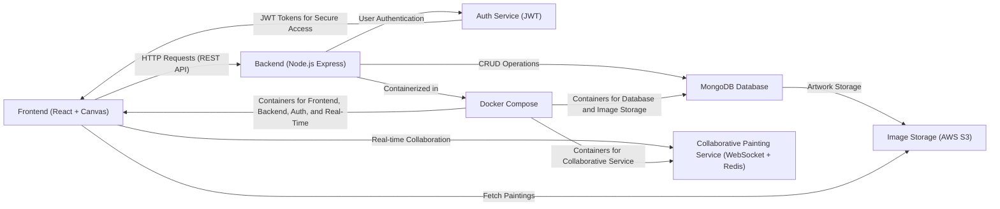

# COMPSCI 426 SCALABLE WEB SYSTEMS
## SPRING 2025
## FINAL PROJECT SUBMISSION

---

# Information

- Name: <TODO: Your name as it appears exactly in Canvas>
- Email: <TODO: Your UMass email address>
- Spire ID: <TODO: Your spire id>
- GitHub User ID: <TODO: Your GitHub User ID>
- Graduation Semester: <TODO: Graduation semester, e.g., Spring 2025>

---

# Overview

**Team Number:**
- <TODO: The team number you were assigned at the start of the semester.>

**System Name:**
- <TODO: Provide the name of the system you worked on.>

**Project Description:**
- <TODO: Describe the system in a brief paragraph (less than 200 words). 
  What problem does it solve? Who is the target audience?>

---

# Architecture Overview

**Primary Architecture Components:**
- <TODO: List and briefly describe the main components of your system 
  (e.g., front-end, back-end, database, etc.).>

**Communication Between Components:**
- <TODO: Describe how the components communicate with each other 
  (e.g., REST APIs, WebSockets, Pub/Sub, etc.).>

**Data Storage:**
- <TODO: Describe how and where data is stored (e.g., relational databases, 
  NoSQL, file storage, etc.).>

# Architecture Diagram



---

# Code Demonstration

## Front-End Code

```javascript
// TODO: Provide the front-end code you worked on here
// Ensure that the code is properly formatted and includes comments to explain key sections

// Example:
function fetchData() {
    // Fetch data from backend API
    fetch('http://localhost:3000/data')
        .then(response => response.json())
        .then(data => console.log(data))
        .catch(error => console.error('Error:', error));
}
```

- **Description:** 
  <TODO: Provide a brief description of the front-end code and its functionality.>

## Microservice Code

```typescript
// TODO: Provide the microservice code you worked on here
// Ensure that the code is properly formatted and includes comments to explain key sections

// Example:
import express from 'express';

const app = express();

// API endpoint to get all items
app.get('/items', (req, res) => {
    // Fetch and return items from database
    res.json(items);
});

app.listen(3000, () => {
    console.log('Server running on port 3000');
});
```

- **Description:**
  <TODO: Provide a brief description of the microservice code and its functionality.>

---

# Docker Configuration

## Dockerfile

```dockerfile
# TODO: Provide the Dockerfile you created
# Ensure that it is correctly formatted and includes comments to explain key sections

# Example:
FROM node:14

# Set the working directory
WORKDIR /app

# Copy the package.json and install dependencies
COPY package.json ./
RUN npm install

# Copy the rest of the application code
COPY . .

# Expose port for the app to run
EXPOSE 3000

# Command to start the application
CMD ["npm", "start"]
```

- **Description:**
  <TODO: Provide a brief description of the Dockerfile and what each section does.>

## docker-compose.yml

```yaml
# TODO: Provide the docker-compose.yml file you created
# Ensure that it is correctly formatted and includes comments to explain key sections

# Example:
version: '3.8'

services:
  frontend:
    build:
      context: ./frontend
    ports:
      - "8080:8080"
  backend:
    build:
      context: ./backend
    ports:
      - "3000:3000"
    depends_on:
      - database
  database:
    image: postgres:13
    environment:
      POSTGRES_USER: user
      POSTGRES_PASSWORD: password
```

- **Description:**
  <TODO: Provide a brief description of the `docker-compose.yml` file and how 
  the services are set up.>

---

# Reflection

**What I Learned:**
- <TODO: Reflect on the key learnings you gained during the project and class. 
  What concepts were most challenging? What skills did you improve on? How did
  the project help you understand scalable web systems better?>

---

**Additional Notes (Optional):**
- <TODO: Any other thoughts or reflections you would like to include.>
